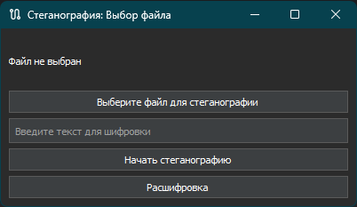

# steganography app by dissentty

Это приложение позволяет скрывать текстовые данные внутри изображений и извлекать их обратно. Вы можете выбрать изображение, ввести текст для шифрования, а также извлечь скрытые данные из картинки.

## Основные возможности

- Скрытие текста в изображениях (PNG, JPG, BMP).
- Извлечение скрытого текста из изображений.
- Ночная тема интерфейса для комфортной работы.
- Простой графический интерфейс на PyQt5.

## Требования

- Python 3.x
- PyQt5
- Stegano (Библиотека для стеганографии)

## Установка

1. Склонируйте репозиторий:
git clone https://github.com/Dissentty/steganography_app

2. Установите необходимые зависимости:
pip install -r requirements.txt

## Запуск приложения

Для запуска приложения выполните следующую команду в терминале:
python main.py

## Использование

1. Скрытие текста в изображении:
   - Нажмите на кнопку "Выберите файл для стеганографии" и выберите изображение.
   - Введите текст для шифровки в текстовое поле.
   - Нажмите кнопку "Начать стеганографию" и выберите место для сохранения нового изображения.
   
2. Извлечение текста из изображения:
   - Нажмите на кнопку "Расшифровка" и выберите изображение с зашифрованным текстом.
   - Программа отобразит скрытый текст.

## Скриншот

## Сборка исполняемого файла

Если вам нужно скомпилировать проект в исполняемый файл (например, для Windows):

1. Установите PyInstaller:
pip install pyinstaller

2. Выполните команду для сборки:
pyinstaller --noconsole --onefile app.py

## Лицензия

Этот проект распространяется под лицензией MIT. Подробности смотрите в файле LICENSE.

---

## Авторы

- dissentty

